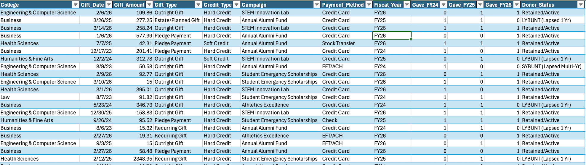

# Higher Education Advancement & Donor Retention Pipeline Analytics

## Executive Summary
This project evaluates alumni gift transactions across 3 Fiscal Years (FY24–FY26) to analyze fundraising performance, track donor retention rates, and identify LYBUNT/SYBUNT lapsed donor pipelines for Advancement teams.

## Portfolio Dashboard
Advancement Executive KPI Dashboard

## Data Architecture & Transformation
- **Data Source:** Synthesized 1,200-row relational dataset spanning 3 Fiscal Years.
- **Hard vs. Soft Credit Split:** Isolated direct cash contributions from donor-advised funds (DAFs) and matching gift entities.
- **Fiscal Year Mapping:** Transformed transaction dates into higher-ed fiscal years using dynamic Excel formulas.
- **YoY Donor Retention:** Calculated active alumni retention rates using multi-criteria matrix logic (`COUNTIFS`).
- **Pipeline Risk (LYBUNT/SYBUNT):** Segmented donors who gave in prior fiscal years but lapsed in FY26 to target re-engagement campaigns.

## Key Technical Skills Demonstrated
- **Excel Analytics Engine:** Advanced dynamic table formulas (`IFS`, `COUNTIFS`, `UNIQUE`, `SUMIFS`), multi-variable Pivot Tables, and KPI card formatting.
- **Data Modeling:** Higher Education Advancement data architecture, constituent mapping, and credit-type accounting.
- **Domain Expertise:** Donor lifecycle segmentation (LYBUNT/SYBUNT analysis), alumni engagement metrics, and campaign performance tracking.
